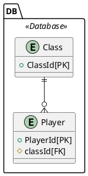

# E-R 図

## はじめに
markdown + plantuml が表示できる環境で見てください。  
具体的には
```
choco install plantuml
```  
して、VSCodeに`PlantUML`と`Markdown Preview Enhanced`を入れてください。  
カーディナリティはカラスの足記法になるみたい。あんまり好きじゃない。


## 仕様をE-R図に起こす。

